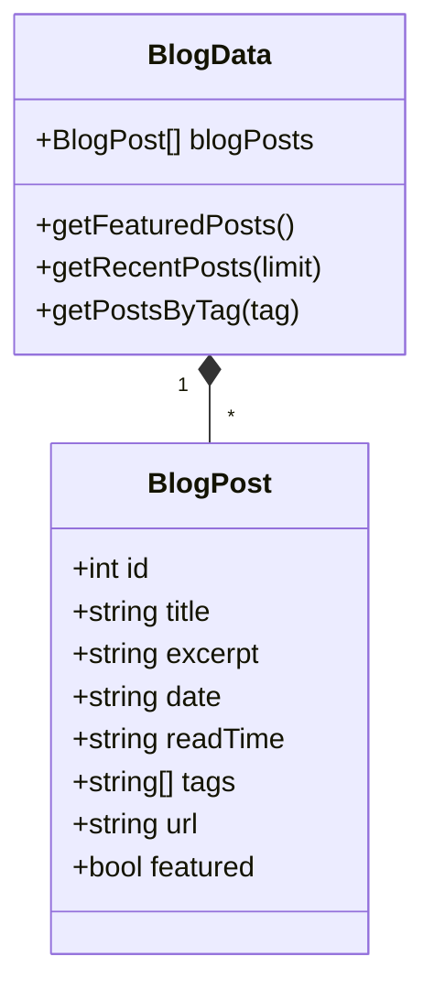

# Class diagram for blog data and filtering logic


```mermaid
classDiagram
    class BlogPost {
        +int id
        +string title
        +string excerpt
        +string date
        +string readTime
        +string[] tags
        +string url
        +bool featured
    }
    class BlogData {
        +BlogPost[] blogPosts
        +getFeaturedPosts()
        +getRecentPosts(limit)
        +getPostsByTag(tag)
    }
    BlogData "1" *-- "*" BlogPost
    ```
    
```

```
```
