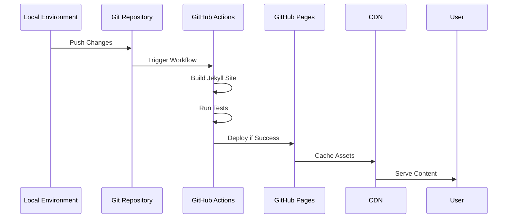
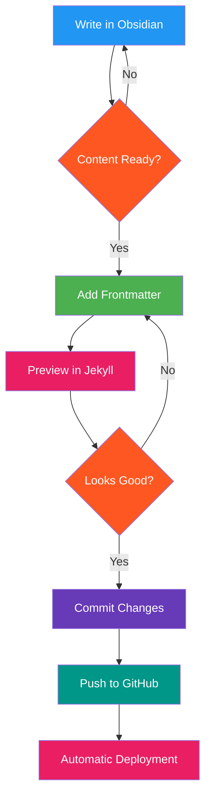
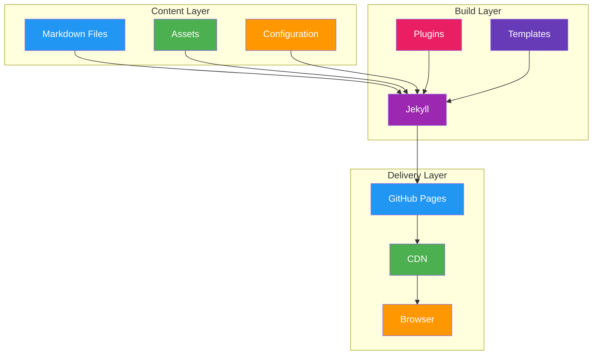

---
tags:
  - "#github"
  - "#github-pages"
  - "#markdown"
  - "#diagrams"
  - "#mermaidjs"
  - "#jekyll"
  - "#type/writeup"
  - "#coding"
  - "#web-development-framework"
description: 
author: 
x: 
github: 
website: 
source: 
created: Sunday, March 30th 2025, 9:57:49 am
title: Git-Hub-Assets
---

# Git-Hub-Assets

## Sequence Diagram for GitHub Pages Deployment

## Flow Diagram for Content Creation Process

## Technical Architecture Flowchart

