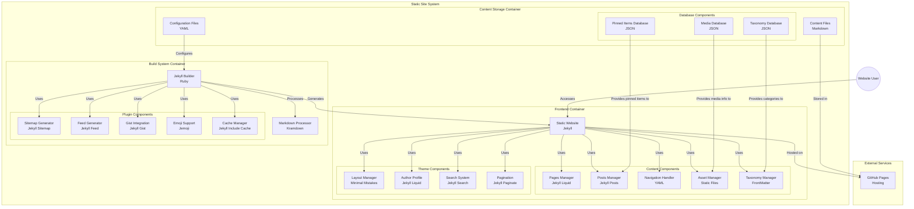

```mermaid
graph TB
    User((Website User))

    subgraph "Static Site System"
        subgraph "Frontend Container"
            StaticSite["Static Website<br>Jekyll"]
            
            subgraph "Content Components"
                Pages["Pages Manager<br>Jekyll Liquid"]
                Posts["Posts Manager<br>Jekyll Posts"]
                Navigation["Navigation Handler<br>YAML"]
                Assets["Asset Manager<br>Static Files"]
                Taxonomy["Taxonomy Manager<br>FrontMatter"]
            end

            subgraph "Theme Components"
                Layout["Layout Manager<br>Minimal Mistakes"]
                AuthorProfile["Author Profile<br>Jekyll Liquid"]
                Search["Search System<br>Jekyll Search"]
                Pagination["Pagination<br>Jekyll Paginate"]
            end
        end

        subgraph "Build System Container"
            JekyllBuilder["Jekyll Builder<br>Ruby"]
            MarkdownProcessor["Markdown Processor<br>Kramdown"]
            
            subgraph "Plugin Components"
                SiteMap["Sitemap Generator<br>Jekyll Sitemap"]
                Feed["Feed Generator<br>Jekyll Feed"]
                Gist["Gist Integration<br>Jekyll Gist"]
                Emoji["Emoji Support<br>Jemoji"]
                Cache["Cache Manager<br>Jekyll Include Cache"]
            end
        end

        subgraph "Content Storage Container"
            subgraph "Database Components"
                MediaDB["Media Database<br>JSON"]
                TaxonomyDB["Taxonomy Database<br>JSON"]
                PinnedDB["Pinned Items Database<br>JSON"]
            end
            
            ContentFiles["Content Files<br>Markdown"]
            ConfigFiles["Configuration Files<br>YAML"]
        end
    end

    subgraph "External Services"
        GitHub["GitHub Pages<br>Hosting"]
    end

    %% Relationships
    User -->|"Accesses"| StaticSite
    
    %% Frontend relationships
    StaticSite -->|"Uses"| Pages
    StaticSite -->|"Uses"| Posts
    StaticSite -->|"Uses"| Navigation
    StaticSite -->|"Uses"| Assets
    StaticSite -->|"Uses"| Layout
    StaticSite -->|"Uses"| AuthorProfile
    StaticSite -->|"Uses"| Search
    StaticSite -->|"Uses"| Pagination
    StaticSite -->|"Uses"| Taxonomy

    %% Build system relationships
    JekyllBuilder -->|"Processes"| MarkdownProcessor
    JekyllBuilder -->|"Uses"| SiteMap
    JekyllBuilder -->|"Uses"| Feed
    JekyllBuilder -->|"Uses"| Gist
    JekyllBuilder -->|"Uses"| Emoji
    JekyllBuilder -->|"Uses"| Cache

    %% Content storage relationships
    ContentFiles -->|"Stored in"| GitHub
    ConfigFiles -->|"Configures"| JekyllBuilder
    MediaDB -->|"Provides media info to"| Assets
    TaxonomyDB -->|"Provides categories to"| Taxonomy
    PinnedDB -->|"Provides pinned items to"| Posts

    %% Cross-container relationships
    JekyllBuilder -->|"Generates"| StaticSite
    StaticSite -->|"Hosted on"| GitHub
```