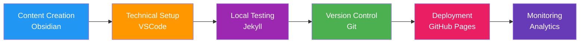
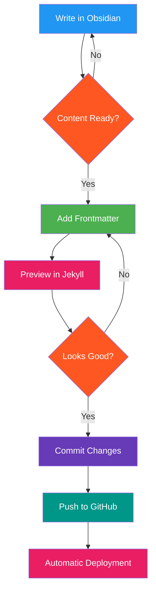
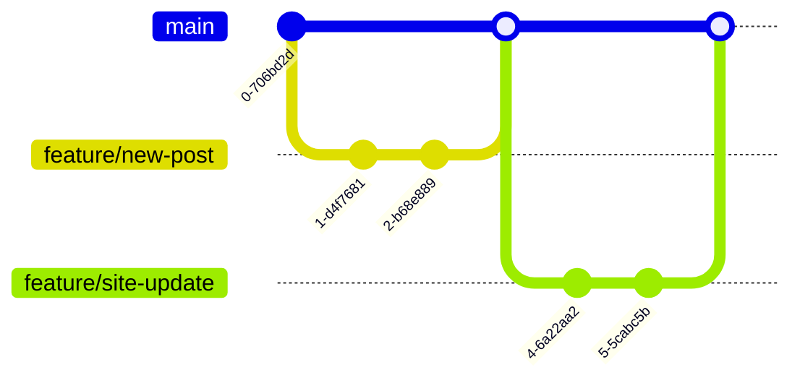
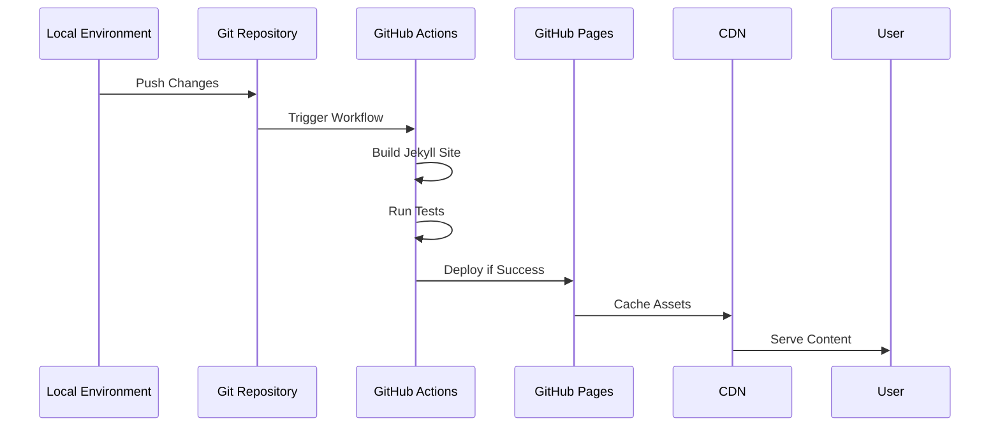
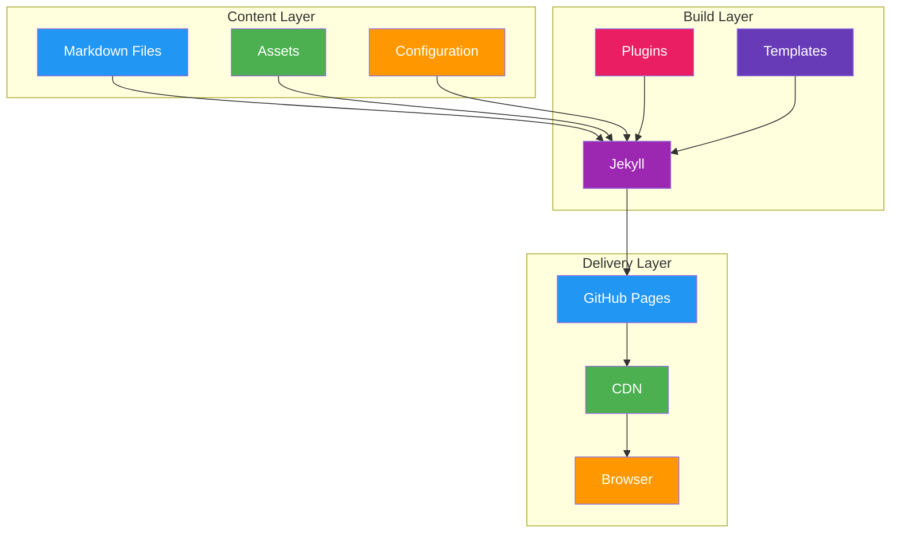

## Content Management Strategy

### Writing Flow
The writing experience is offered by Obsidian so that all setups are smooth and create content faster. Features like a file explorer, search, and document outlining aid in the organization and rapid location of information, while a powerful markdown editor facilitates intuitive formatting. It makes sure content is all related through internal linking to help with navigation within your site.

### Metadata Management (through Frontmatter)
Frontmatter creates a consistent structure and storage for the metadata of all the posts. The structure of this JSON-based system includes required fields including title, description, date, tags, and categories. They handle content filtering, sorting, and automation across the website much more efficiently.

```json
{
  "frontMatter.taxonomy.contentTypes": [
    {
      "name": "post",
      "fields": [
        {
          "title": "Title",
          "name": "title",
          "type": "string",
          "required": true
        },
        {
          "title": "Description",
          "name": "description",
          "type": "string",
          "required": true
        },
        {
          "title": "Publishing date",
          "name": "date",
          "type": "datetime",
          "required": true
        },
        {
          "title": "Tags",
          "name": "tags",
          "type": "tags"
        },
        {
          "title": "Categories",
          "name": "categories",
          "type": "categories"
        }
      ]
    }
  ]
}
```

### Content Organization
Knowledge is organized and tagged in a structured format, allowing content to be searched and organized easily. Taxonomy data is stored in `.frontmatter/database/taxonomyDb.json` to allow you to browse it structured. Posts get organized in terms of categories, tags, and years, which means users have an organized, logical, and intuitive navigation structure to visit.

- **Categories** (`/categories/`): Bundle related content
- **Tags** (`/tags/`): Enhance search capabilities
- **Years** (`/posts/`): Chronological organization of posts

## Development and Deployment Strategy

### Overall Workflow
The development process follows a structured path from content creation to deployment:



### Content Creation Process
The content creation and publishing workflow ensures quality and consistency through a defined process:



### Version Control Strategy
Our Git branching strategy maintains clean code and enables collaborative development:



### Deployment Pipeline
The automated deployment process ensures reliable and consistent site updates:



## Technical Architecture

### Component Structure
The site architecture is organized into three main layers that work together seamlessly:



### Monitoring and Analytics
Continuous monitoring helps optimize site performance and user experience:


