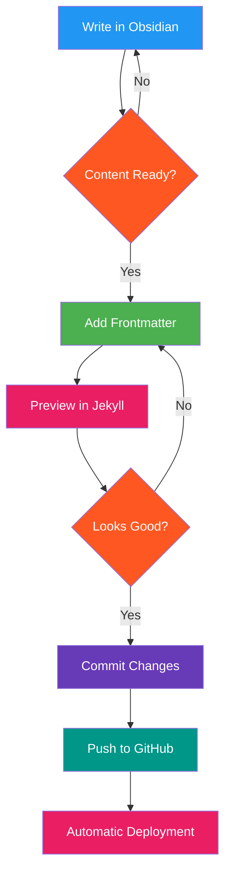
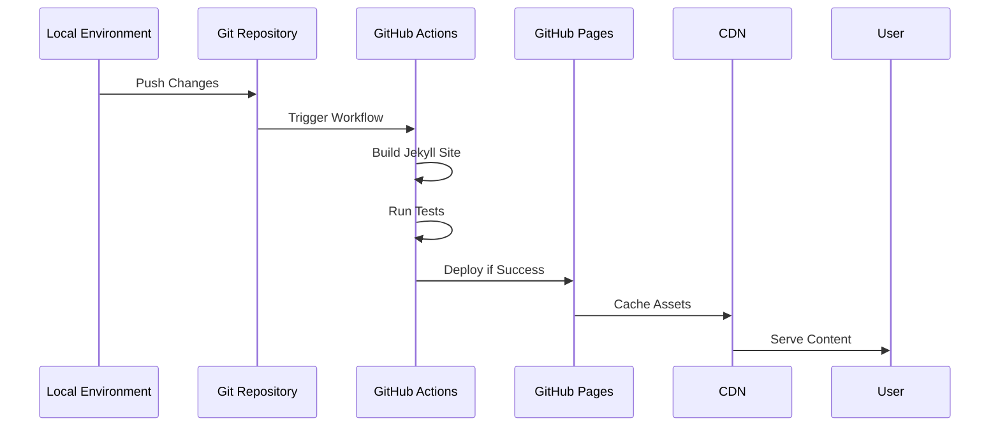
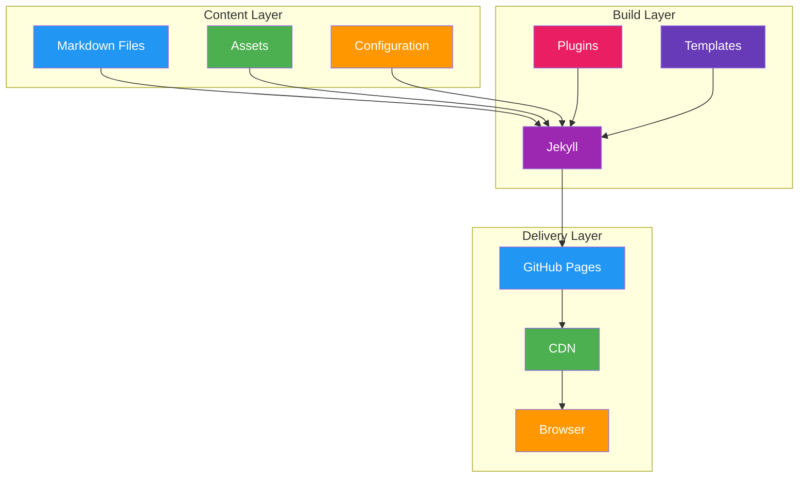

## Content Management Workflow

### Writing Flow

Obsidian provides the writing environment, making content creation seamless and efficient. Its powerful markdown editor allows for intuitive formatting, while features like file explorer, search, and document outlining help organize and locate information quickly. Internal linking enhances content connectivity, making navigation effortless.

### Metadata Management (via Frontmatter)

Metadata is structured and stored using Frontmatter, ensuring consistency across all posts. This JSON-based system defines essential fields such as title, description, date, tags, and categories. Proper metadata management helps streamline content filtering, categorization, and automation within the website.

```json
{
  "frontMatter.taxonomy.contentTypes": [
    {
      "name": "post",
      "fields": [
        {
          "title": "Title",
          "name": "title",
          "type": "string",
          "required": true
        },
        {
          "title": "Description",
          "name": "description",
          "type": "string",
          "required": true
        },
        {
          "title": "Publishing date",
          "name": "date",
          "type": "datetime",
          "required": true
        },
        {
          "title": "Tags",
          "name": "tags",
          "type": "tags"
        },
        {
          "title": "Categories",
          "name": "categories",
          "type": "categories"
        }
      ]
    }
  ]
}
```

### Content Organization

Content is categorized and tagged systematically to facilitate easy retrieval and organization. Taxonomy data is stored in `.frontmatter/database/taxonomyDb.json`, allowing structured browsing. Posts are arranged by categories, tags, and years, ensuring a logical and intuitive navigation structure for users.

- **Categories** (`/categories/`): Group similar content together
- **Tags** (`/tags/`): Provide specific identifiers for refined search
- **Years** (`/posts/`): Organize posts chronologically

## Development Workflow

A local preview of the website can be accessed at `http://localhost:4000`, enabling real-time content validation. Git integration ensures version control, allowing for efficient tracking of changes. Jekyll serves as the static site generator, seamlessly compiling markdown files into a functional website hosted via GitHub Pages.

### Workflow Overview

The development process follows a structured path from content creation to deployment:


### Content Flow Process

The content creation and publishing workflow ensures quality and consistency:

1. Write content in Obsidian
2. Review and refine
3. Add necessary metadata
4. Preview locally
5. Deploy when ready



### Git Branching Strategy

Our version control strategy maintains clean code and enables collaborative development:


### Deployment Pipeline

The automated deployment process ensures reliable and consistent site updates:



### Component Architecture

The site architecture is organized into three main layers:

1. Content Layer: Manages all content and assets
2. Build Layer: Processes and generates the site
3. Delivery Layer: Serves content to users



### Monitoring and Analytics Flow

Continuous monitoring helps optimize site performance and user experience:


These diagrams provide visual representations of:
1. Overall workflow overview
2. Content creation and publishing flow
3. Git branching strategy
4. Deployment pipeline sequence
5. Component architecture
6. Monitoring and analytics cycle

Each diagram uses vibrant colors with white text for maximum readability, while maintaining a professional appearance. The color schemes help distinguish different components and stages of the process while ensuring text remains clearly visible.

### Recommended Process

1. **Create content** using Obsidian, leveraging its markdown editor and organization tools
   - Write content in a distraction-free environment with live preview
   - Utilize Obsidian's linking capabilities for connected thought
   - Take advantage of templates and plugins for consistent content structure

2. **Manage metadata** with Frontmatter to structure content effectively and maintain consistency
   - Use the Frontmatter VSCode extension to manage post metadata
   - Ensure all required fields (title, description, date) are properly filled
   - Apply consistent tagging and categorization for better content organization

3. **Preview locally** with Jekyll to ensure the site builds correctly before deployment
   - Run `bundle exec jekyll serve` to start local development server
   - Check content rendering, layout, and responsive design
   - Verify all links, images, and embedded content work as expected

4. **Commit changes** using Git for version control, enabling rollback and collaboration
   - Stage and commit changes with meaningful commit messages
   - Review changes using Git diff before committing
   - Maintain a clean Git history for easier collaboration

5. **Automatic deployment** via GitHub Pages ensures the site updates seamlessly after commits
   - Push changes to the main branch to trigger automatic deployment
   - Monitor GitHub Actions for successful build and deployment
   - Verify changes are live on the production site

### Content Structure

The website's structure is logically organized into directories, ensuring clean and efficient content management:

- **Posts**: Stored in `_posts` directory, managed by Frontmatter for structured metadata
- **Pages**: Stored in `_pages` directory to separate standalone content from posts
- **Assets**: Stored in `assets` directory for media, images, and other resources
- **Navigation**: Defined in `_data/navigation.yml`, structuring menu links and internal navigation

This workflow integrates Obsidian's editing capabilities, Frontmatter's metadata management, and Jekyll's static site generation, creating a seamless and efficient content publishing system.


