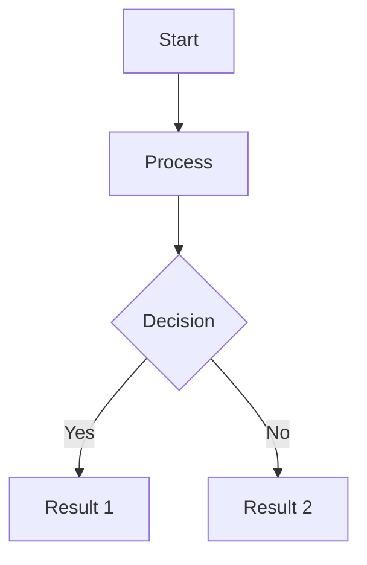
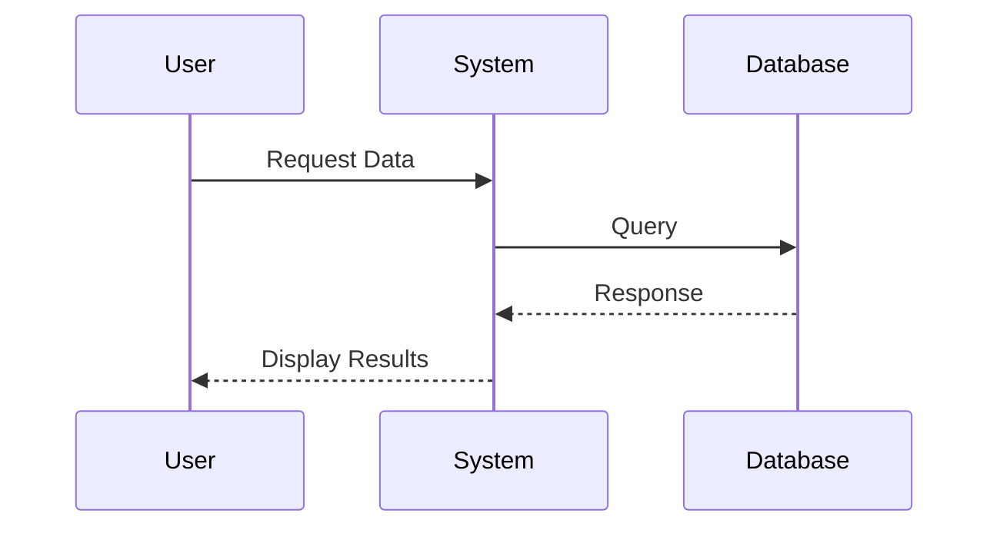


## Table of Contents
{: .no_toc }
* TOC
{:toc}


## Introduction
Brief overview of the post topic and what readers will learn.

## Main Content Section

### Subsection with Mermaid Diagram




### Subsection with Code Example
```ruby
def example_method
  puts "This is a code block"
end
```

### Subsection with Notice

**Important Note:**
This is a notice block for important information.


<div class="notice--info">
  {{ notice-text | markdownify }}
</div>

## Advanced Features

### Image with Caption


### Collapsible Content
<details>
<summary>Click to expand</summary>

This content is hidden by default but can be expanded.

</details>

### Complex Mermaid Diagram




## References and Further Reading
- [Reference Link 1][1]
- [Reference Link 2][2]

## Related Posts


<ul>
  
  <li><a href="{{ post.url }}">{{ post.title }}</a></li>
  
</ul>


---
[1]: https://example.com/reference1
[2]: https://example.com/reference2

