# Winter Bike Lane Snow Removal in Quebec City: Examining Costs and Usage

---

## Introduction

Since 2023, Quebec City has promoted its “white network,” a winter cycling system designed to support year-round active transportation. Positioned as both environmentally responsible and cost-efficient, the initiative has become a visible part of the city’s mobility strategy.

However, a review of municipal budgets, usage data, and snow removal contracts suggests that some aspects of the program—particularly its cost structure and seasonal usage—deserve closer examination. Using the Chemin Sainte-Foy corridor as a case study, this analysis aims to better understand how resources are allocated and how costs compare to actual usage.

---

## 1. Comparing Costs: Annual Metrics vs Seasonal Reality

Public statements have emphasized that cycling infrastructure is significantly less expensive than road infrastructure when measured per kilometer traveled. This comparison is generally based on annual, system-wide data.

At the same time, winter cycling usage is highly seasonal. Automated counters indicate a substantial drop in ridership during colder months, with daily trips across the network declining significantly compared to summer levels.

When focusing specifically on winter usage:

- Approximately **60,000 trips** are recorded over the season  
- A planned **$200,000 increase** in 2026 is allocated to snow removal for new segments  

This suggests a **cost of roughly $3.33 per trip**, depending on assumptions and scope. While not directly comparable to annual infrastructure costs, this metric provides additional context for evaluating winter-specific spending.

---

## 2. Budget Transparency and Cost Allocation

Municipal financial reports for 2023 and 2024 group snow removal expenses into a broader winter operations budget of approximately **$92.2 million**, without isolating costs related specifically to cycling infrastructure.

In the 2026 budget, however, a dedicated **$200,000 allocation** appears for the maintenance of new four-season cycling routes. This marks one of the first instances where such costs are partially itemized.

This shift raises questions about how winter cycling infrastructure has been accounted for historically, and whether more detailed breakdowns could improve public understanding of spending priorities.

---

## 3. Case Study: Chemin Sainte-Foy

The Chemin Sainte-Foy corridor illustrates how winter cycling infrastructure is managed operationally:

- Classified as **Priority 1**, meaning it is cleared on a timeline similar to major roadways  
- Snow removal delivered through municipal teams and external contractors, including a **$3.66 million contract awarded in 2024** covering multiple sectors  

Winter usage on this corridor is estimated at approximately **205 trips per day**, compared to significantly higher volumes during the summer months.

While precise per-user costs are difficult to isolate without a full breakdown, the combination of high service levels and lower seasonal usage suggests that **cost per trip is higher in winter than in other periods**.

---

## 4. Broader Trends in Snow Removal Spending

Quebec City’s snow removal budget has increased in recent years:

- Approximately **$60 million in 2020**  
- Peaking at **$104.5 million in 2025**  
- Stabilizing at around **$96 million in 2026**

The city attributes part of its cost management strategy to investments in technology, including vehicle telemetry systems intended to improve efficiency and planning.

While these measures may yield long-term benefits, overall spending levels remain elevated, reflecting broader pressures such as inflation, fuel costs, and labor constraints.

---

## 5. Policy Priorities and Network Expansion

Public statements have indicated that winter cycling is not considered a primary priority within the broader transportation system. At the same time, the city continues to expand its winter cycling network and allocate targeted funding to support it.

This reflects the complexity of balancing:

- Environmental and mobility goals  
- Budgetary constraints  
- Service expectations across different types of infrastructure  

---

## Conclusion

The development of Quebec City’s winter cycling network highlights important questions about how infrastructure is evaluated and funded:

- How should seasonal usage be factored into cost comparisons?  
- What level of detail should be provided in public financial reporting?  
- How can cities balance competing priorities across transportation systems?  

Providing clearer data on costs and usage—particularly for winter-specific operations—could help support more informed public discussion and decision-making.

---

## Data

### Most-used corridor: Chemin Sainte-Foy
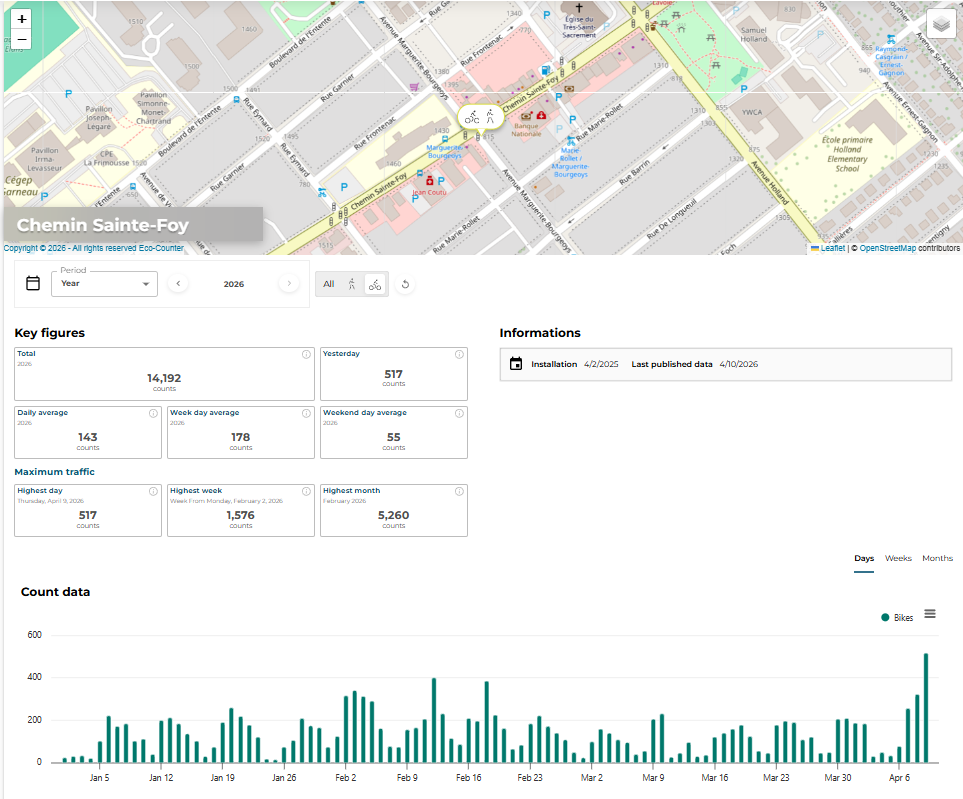

---

### Beauportois Corridor
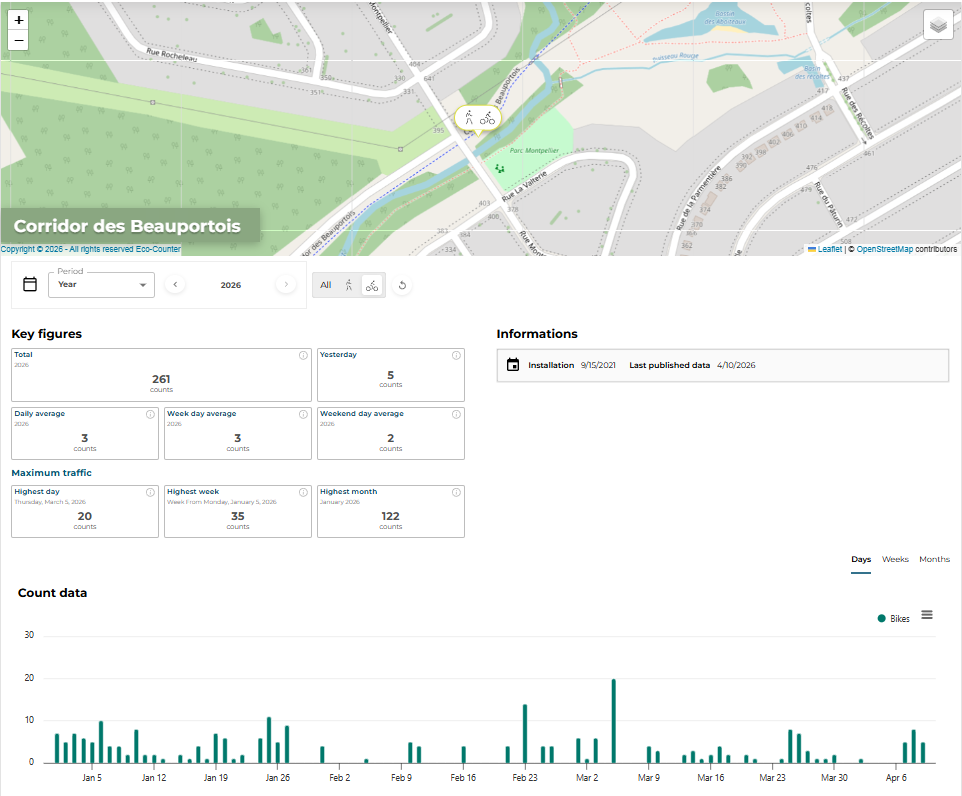

---

### Cheminots Corridor
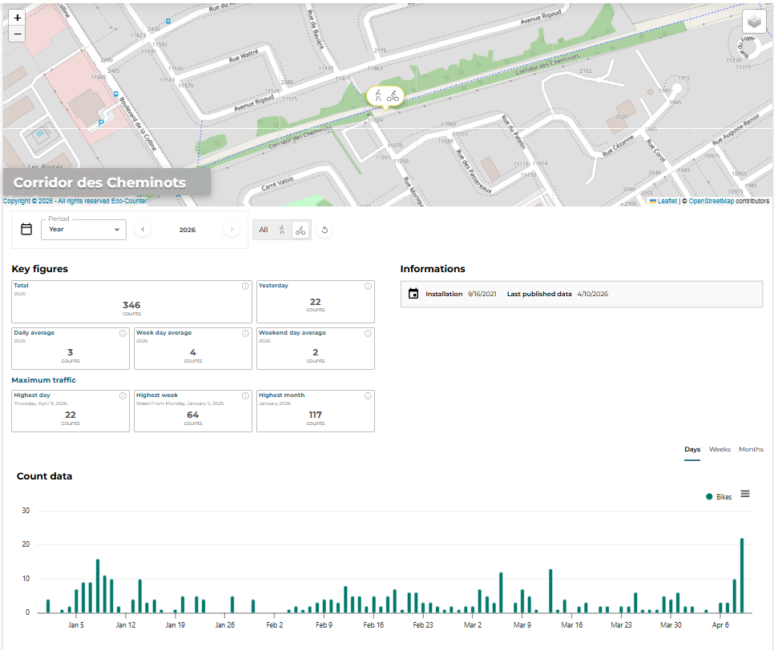

---

### Littoral / Montmorency Falls Corridor
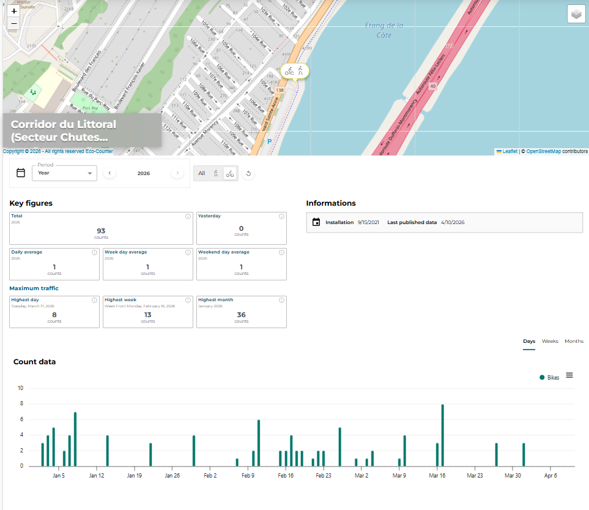

---

### Littoral / Maizerets Corridor
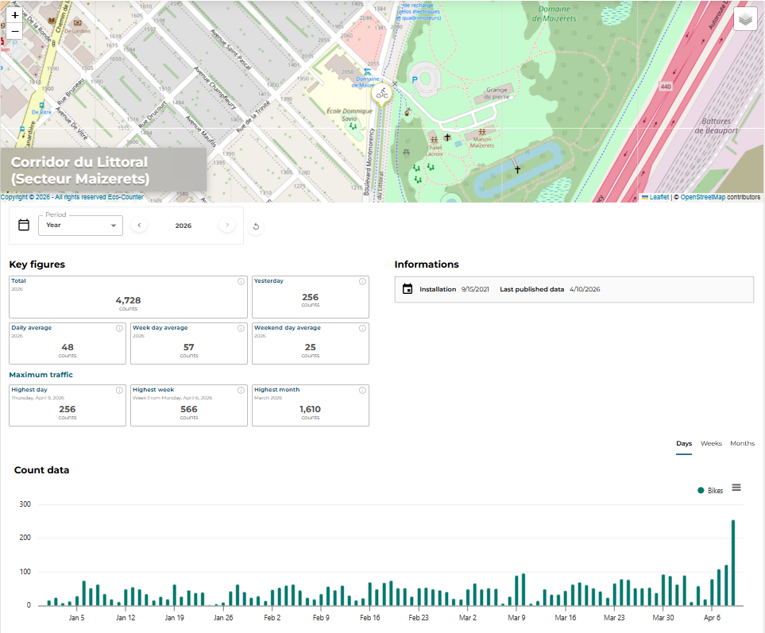

---

### Père-Marquette Corridor
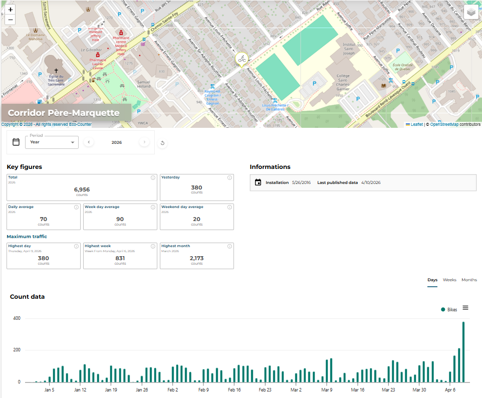

---

### Dalhousie
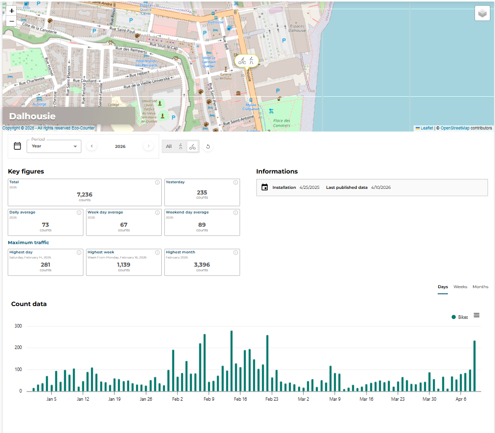

---

### Einstein
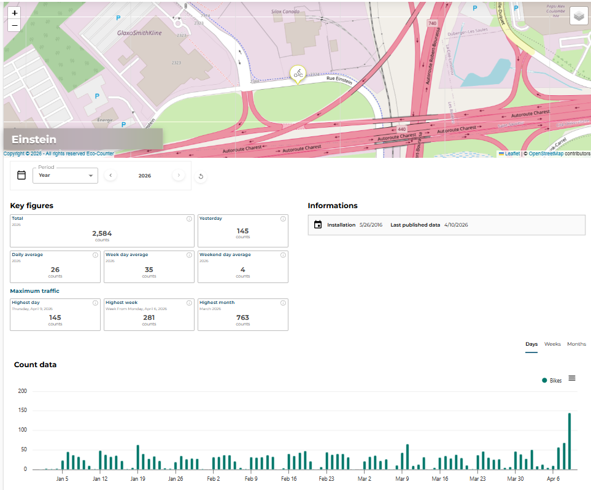

---

### Parc des Saules
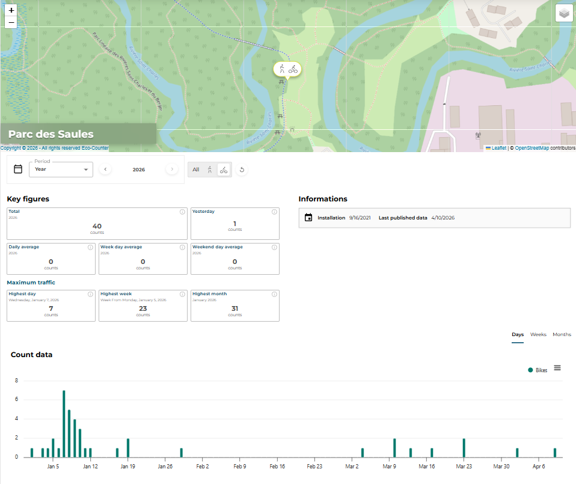

---

### Saint-Charles River
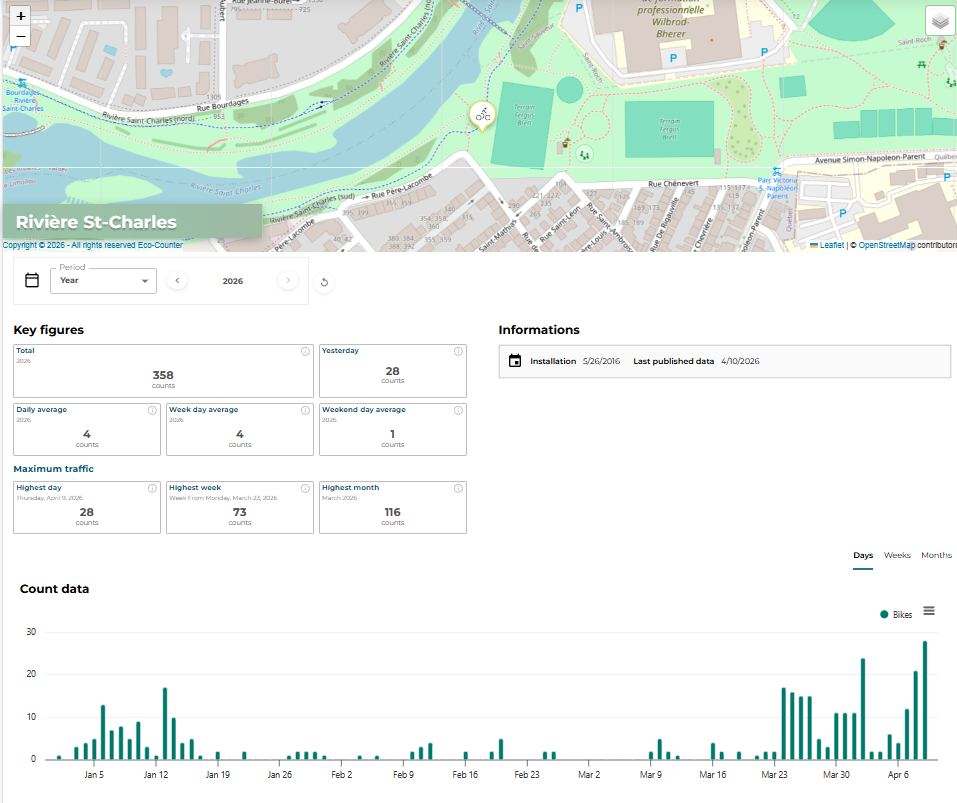

---

### Route de l’Église
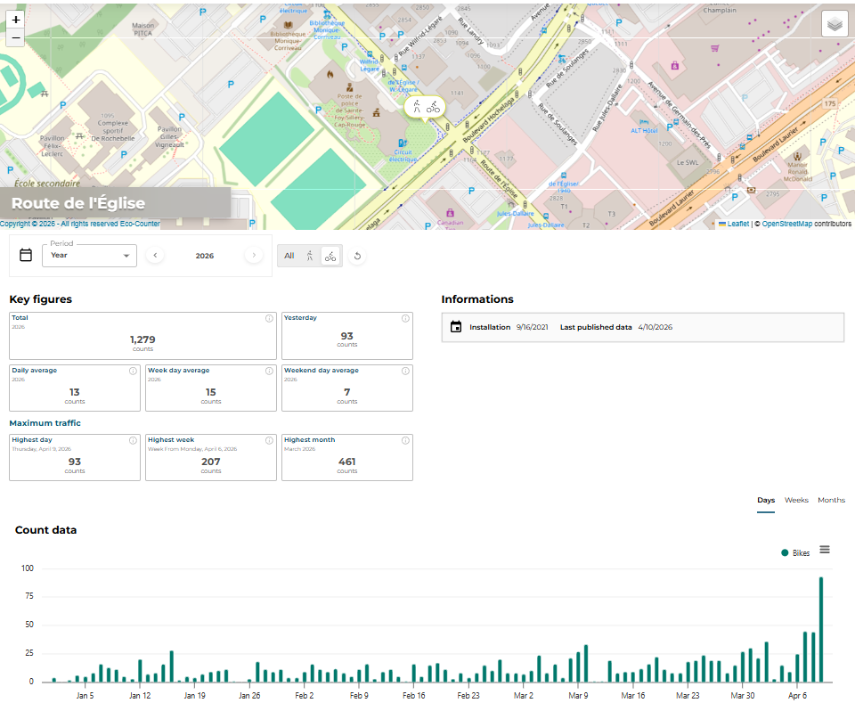

---

## Sources

- Quebec City Budget 2026 (pp. 27, 166, 167)  
- Municipal accountability reports (2023–2024)  
- Snow removal contract (Hamel Construction, July 2024)  
- Media interviews and coverage (May 2024)  
- Traffic data (2025–2026):  
  https://villedequebec.eco-counter.com/site/300052537  

---

## Presentation Video 🎥

[https://www.youtube.com/watch?v=MsKeiUNAIZc](https://www.youtube.com/watch?v=MsKeiUNAIZc)